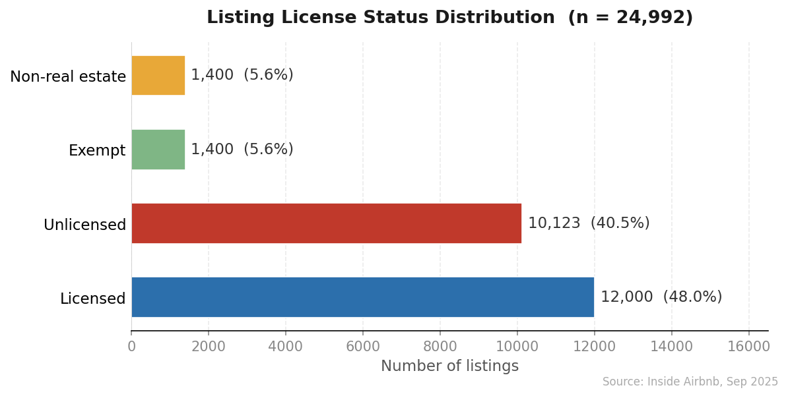
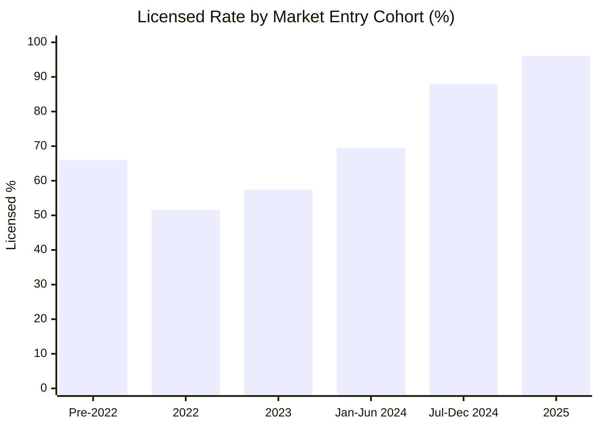
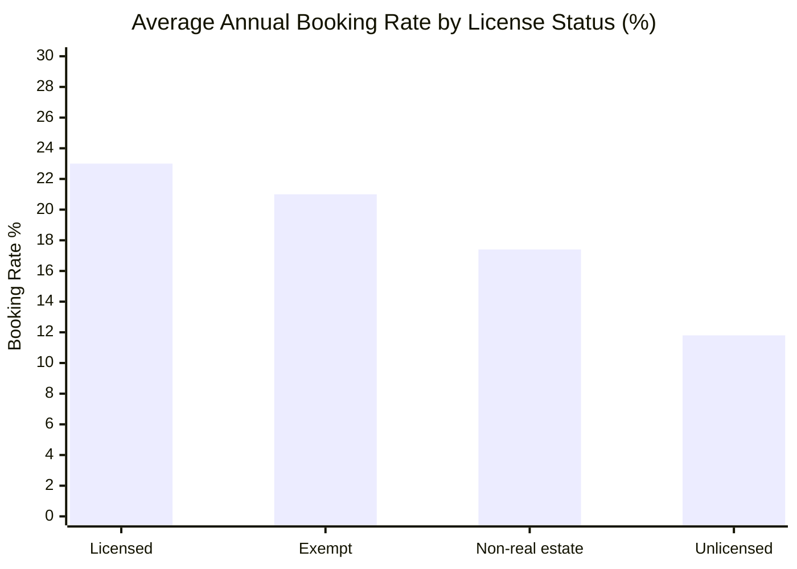

# Spatio-Temporal Impact of Short-Term Rental Regulation on Airbnb in Istanbul

**DI 722 – Spatio-Temporal Data Mining | METU Graduate School of Informatics**  
**Author:** Eda Yılmaz  
**Date:** May 2026

---

## Table of Contents

1. [Introduction & Motivation](#1-introduction--motivation)
2. [Dataset](#2-dataset)
3. [H3 DGGS: The Spatial Indexing Framework](#3-h3-dggs-the-spatial-indexing-framework)
4. [Literature Review](#4-literature-review)
5. [Baseline Method](#5-baseline-method)
6. [Preliminary Results](#6-preliminary-results)
7. [Planned Extensions](#7-planned-extensions)
8. [Repository Structure](#8-repository-structure)
9. [Requirements](#9-requirements)

---

## 1. Introduction & Motivation

On **1 January 2024**, Turkey enacted **Law No. 7464**, the country's first national permit system for short-term rentals (STRs). Every host renting a residential property for fewer than 100 consecutive nights must now obtain a permit from the Ministry of Culture and Tourism. Properties without a valid permit face fines of up to 100,000 TRY and possible listing removal.

This law creates a **natural experiment** of exceptional value for spatio-temporal data mining: a discrete, nationwide regulatory shock applied simultaneously to all listings in all Turkish cities. Istanbul, with its dense and geographically heterogeneous Airbnb market spanning the historic peninsula, Bosphorus waterfront, and peripheral suburbs, offers an ideal setting to study how regulation interacts with space.

This project investigates three interconnected questions:

1. **Licensing geography:** Where in Istanbul are unlicensed listings clustered, and what spatial patterns characterise the unlicensed stock 21 months after the law took effect?
2. **Price penalty:** Do unlicensed listings price themselves differently from licensed ones, controlling for property type, availability, and neighbourhood?
3. *(Planned)* **Temporal dynamics:** How did the regulatory shock affect listing prices and availability in the period before and after January 2024?

The study sits at the intersection of **urban economics, public policy, and spatio-temporal data mining**, combining individual-level licensing status classification, hexagonal spatial indexing, formal spatial autocorrelation statistics, and a 12-month booking time series to characterise how the distribution of licensed and unlicensed listings is spatially structured and how it shapes occupancy dynamics across the city.

---

## 2. Dataset

### Source

**Inside Airbnb**, an independent, non-commercial project that scrapes and publishes Airbnb listing data at regular intervals. Data for Istanbul were downloaded on **29–30 September 2025** and are publicly available at [insideairbnb.com](https://insideairbnb.com/get-the-data/).

Two files are used:

| File | Rows | Columns | Content |
|---|---|---|---|
| `listings.csv` | 30,051 | 79 | One row per listing: price, location, room type, license, reviews, host info |
| `calendar.csv.gz` | ~10.9 million | 7 | Daily availability for each listing, Sep 2025 – Sep 2026 |

### Temporal Coverage

The current dataset captures a **single cross-section** (September 2025), taken 21 months after the law came into force. Historical data for 2023–2024 have been formally requested from Inside Airbnb; if received, a difference-in-differences analysis will be added as an extension (see Section 7).

### Key Variables

| Variable | Type | Role |
|---|---|---|
| `price` | Continuous | Nightly rate in Turkish Lira (TRY), **dependent variable** |
| `license` | Categorical | Raw permit field collected from Airbnb; contains permit numbers, "Exempt", "Non-real estate listing", or NaN |
| `license_status` | Derived categorical | Classified into: **Licensed**, **Unlicensed**, **Exempt**, **Non-real estate** |
| `latitude` / `longitude` | Continuous | Listing coordinates, used for H3 cell assignment |
| `room_type` | Categorical | Entire home/apt, Private room, Shared room, Hotel room |
| `availability_365` | Integer | Nights available per year (0–365) |
| `accommodates` | Integer | Maximum number of guests |
| `neighbourhood_cleansed` | Categorical | Istanbul district (standardised by Inside Airbnb) |
| `first_review` / `last_review` | Date | Used to proxy listing activity relative to the regulatory shock |

### License Status Classification

The raw `license` field was mapped to a four-category license status variable:

| Raw `license` value | Classified as | Rationale |
|---|---|---|
| NaN (empty) | **Unlicensed** | No permit number on record |
| Numeric / alphanumeric string | **Licensed** | Holds a valid permit number |
| `"Exempt"` | **Exempt** | Legally exempt from permit requirement |
| `"Non-real estate listing"` | **Non-real estate** | Hotels and B&Bs, different legal category |

### Data Cleaning

| Step | Removed | Kept |
|---|---|---|
| Remove listings with no price | 1,059 | 28,992 |
| Remove top 1% price outliers | 291 | 28,701 |
| Remove implausible prices (< 100 TRY) | ~3,709 | 24,992 |
| Remove coordinates outside Istanbul bbox | 0 | 24,992 |
| **Final analytical sample** | | **24,992** |

---

## 3. H3 DGGS: The Spatial Indexing Framework

### Why Hexagons for This Study?

Three properties make H3 particularly suited to STR analysis:

1. **Uniform neighbourhood relationships.** Every cell has exactly six neighbours at equal distance. This makes spatial autocorrelation measures (Moran's I, Local Indicators of Spatial Association) more geometrically consistent.
2. **Hierarchical aggregation.** A resolution-7 cell contains exactly seven resolution-8 cells. This allows multi-scale analysis without re-projecting data.
3. **Compact cell shapes.** Hexagons minimise the boundary-to-area ratio, reducing the "edge effect" that distorts neighbourhood statistics in irregular administrative boundaries like Istanbul's districts.

### Resolution Selection

| Resolution | Approx. Area | Avg. edge length | Use case |
|---|---|---|---|
| 7 | ~5.16 km² | ~1.2 km | District-level overview |
| **8** | **~0.74 km²** | **~0.46 km** | **Baseline (this study)** |
| 9 | ~0.11 km² | ~0.17 km | Block-level detail |

**Resolution 8** (~0.74 km²) was selected for the baseline analysis. At this scale, each cell contains an average of **19.8 listings**, large enough for stable cell-level statistics and small enough to capture intra-district heterogeneity. Resolution 9 was also tested (producing 1,879 cells at ~6.5 listings/cell on average), but was found to be too granular for the available sample size.

### Implementation

Each listing is assigned to its H3 cell using its latitude and longitude coordinates. Cell-level statistics (unlicensed rate, average price, availability, room type share, review score) are then aggregated per cell, and cell boundaries are reconstructed as geographic polygons for mapping. The result is **1,262 H3 cells at resolution 8** covering the Istanbul metropolitan area, saved as `Data/istanbul_airbnb_h3.geojson`.

| H3 Grid Summary | Value |
|---|---|
| Resolution | 8 |
| Total cells covering Istanbul | 1,262 |
| Average listings per cell | 19.8 |
| Minimum listings in a cell | 1 |
| Cell area | ~0.74 km² |
| Output format | GeoJSON (EPSG:4326) |

### H3 vs. Administrative Boundaries

A key advantage of H3 over administrative districts is **consistency**: Istanbul's 39 districts vary enormously in size (from ~4 km² Beşiktaş to ~620 km² Çatalca). Cell-level analysis with H3 controls for this variation and avoids the Modifiable Areal Unit Problem (MAUP) that would affect any analysis at the district level.

---

## 4. Literature Review

### 4.1 Short-Term Rentals and Urban Housing Markets

**Koster, H. R. A., van Ommeren, J., & Volkhausen, N. (2021).** Short-term rentals and the housing market: quasi-experimental evidence from Airbnb in Los Angeles. *Journal of Urban Economics*, 124, 103356. [DOI: 10.1016/j.jue.2021.103356]
*(> 200 citations as of 2025)*

This landmark study exploits variation in Airbnb market entry across Los Angeles census tracts to identify the causal impact of STRs on long-term rental prices and owner-occupancy rates. Using a quasi-experimental design, the authors find that a 10% increase in Airbnb listings raises local rents by approximately 0.4%. The methodological framework, treating spatial and temporal variation in platform adoption as a natural experiment, directly informs the DiD extension planned for Phase 2 of this project when historical data become available.

**Relevance to this study:** Establishes the econometric precedent for natural-experiment designs in STR research. The compliance shock from Law No. 7464 provides an analogous exogenous variation at the national level.

---

### 4.2 STR Regulation and Platform Response

**Bei, G., & Celata, F. (2023).** Challenges and effects of short-term rentals regulation: A counterfactual assessment of European cities. *Annals of Tourism Research*, 101, 103605. [DOI: 10.1016/j.annals.2023.103605]

This paper evaluates the effectiveness of STR regulation across European cities using a counterfactual design, documenting that permit-based systems produce measurable reductions in listing volumes and pricing differentials between regulated and unregulated segments. The authors demonstrate that regulatory outcomes vary substantially by enforcement capacity and local institutional context, a finding directly applicable to Istanbul's centralised, resource-constrained enforcement model.

**Relevance to this study:** Turkey's Law No. 7464 most closely matches the permit-system archetype analysed by Bei & Celata, and their finding that enforcement capacity moderates regulatory impact provides the theoretical basis for expecting spatially uneven licensing rates in Istanbul.

---

### 4.3 Spatio-Temporal Dynamics of STR Markets

**Pettas, D., & Suwala, L. (2023).** Spatiotemporal dynamics of Airbnb in European capital cities. *Erdkunde*, 77(2), 123–142. [DOI: 10.3112/erdkunde.2023.02.03]

Using multi-year Inside Airbnb data for seven European capitals, Pettas & Suwala demonstrate that Airbnb market concentration follows distinct spatial trajectories: initial clustering in tourist cores, gradual diffusion to peripheral neighbourhoods, and post-regulation re-concentration in licensed zones. Their approach, combining H3-style grid aggregation with temporal panel data, provides a methodological template for this project's Phase 2.

**Relevance to this study:** Confirms that STR regulation produces spatially heterogeneous responses across a city, motivating the H3-based granular spatial analysis rather than district-level averages.

---

### 4.4 Spatial Effects of STR Regulation: European Evidence

**Bei, G. (2025).** The spatial effect of short-term rental regulations: The comparison between Barcelona and Paris. *Cities*, 158, 105603. [DOI: 10.1016/j.cities.2024.105603]

Bei uses GIS boundary analysis to demonstrate that permit-based STR regulation in Barcelona and Paris produces sharp spatial discontinuities in listing density and pricing near regulatory borders. The finding that licensed and unlicensed listings coexist spatially at fine-grained scales, rather than sorting neatly by administrative zone, motivates this study's use of sub-district H3 cells rather than district-level aggregates.

**Relevance to this study:** Confirms that regulatory effects are spatially heterogeneous within cities, not uniform across administrative boundaries. This is precisely what the H3 + Moran's I + LISA framework in this project is designed to measure for Istanbul.

---

### Research Gap

Existing Istanbul studies have examined STR dynamics in relation to tourism, housing markets, and gentrification, but have relied on district-level aggregate data and have not applied sub-district spatial indexing, formal spatial autocorrelation statistics, or individual listing-level licensing analysis.

This project addresses those methodological gaps by:
1. Classifying each of 24,992 listings individually as licensed or unlicensed using the raw `license` field.
2. Applying H3 hexagonal spatial indexing at ~0.74 km² resolution, substantially finer than administrative districts.
3. Computing formal spatial autocorrelation (Global and Local Moran's I) to identify statistically significant unlicensed listing clusters.
4. Integrating a 12-month forward booking time series from `calendar.csv.gz` with spatial licensing data to characterise spatio-temporal occupancy dynamics.

---

## 5. Baseline Method

The baseline model addresses the question: *Do licensing status and spatial location predict nightly Airbnb listing prices in Istanbul, and by how much do unlicensed listings undercut their licensed counterparts?*

### 5.1 Spatial Aggregation with H3

As described in Section 3, each of the 24,992 cleaned listings is assigned to one of **1,262 H3 cells** at resolution 8. Cell-level statistics (mean price, unlicensed percentage, entire-home share, etc.) are computed and exported as a GeoJSON file for visualisation.

### 5.2 Regression Specification

Because price is right-skewed (Airbnb nightly rates in Istanbul range from 100 TRY to over 100,000 TRY), the dependent variable is log-transformed. The baseline OLS specification regresses log(price) on license status, property characteristics, and location fixed effects. The coefficient on the `Unlicensed` variable is the **licensing price gap**: the percentage difference in price between unlicensed and licensed listings, holding all other factors constant.

### 5.3 Model Features

| Feature | Type | Role |
|---|---|---|
| `is_unlicensed` | Binary | **Key variable:** 1 = no permit, 0 = licensed/exempt |
| `availability_365` | Continuous | Controls for listing activity intensity |
| `accommodates` | Integer | Controls for property size |
| `is_entire_home` | Binary | Controls for property type |
| Room type dummies | Categorical | Absorb property-type fixed effects |
| Top-10 neighbourhood dummies | Categorical | Absorb location fixed effects |

**Total features:** 25 | **Train/test split:** 80/20 | **Method:** OLS with log-transformed dependent variable

### 5.4 Limitations of the Baseline

The baseline model is deliberately parsimonious, and several limitations are acknowledged:

- **Cross-sectional only.** With a single time point, causal inference is not possible; the price gap between licensed and unlicensed listings could reflect omitted property quality rather than a regulatory effect.
- **OLS assumptions.** Spatial autocorrelation among nearby listings likely violates the independence assumption. A Geographically Weighted Regression (GWR) model is planned for Phase 2.
- **License coding.** The NaN = unlicensed assumption is standard in the Inside Airbnb literature but may mis-classify listings whose permits exist but were not entered on the platform. Additionally, since Airbnb has no verification system for license numbers, some "Licensed" listings may hold fabricated permit numbers, introducing noise in both directions.
- **No amenity controls.** Bedroom count, bathroom count, and amenity richness are correlated with both price and license status but are incompletely observed in the current dataset.

---

## 6. Preliminary Results

### 6.1 Licensing Status Distribution

Of the 24,992 listings in the cleaned sample:

| License Status | Count | Share |
|---|---|---|
| Unlicensed (no permit) | 10,123 | 40.5% |
| Licensed (valid permit) | ~12,000 | ~48% |
| Exempt | ~1,400 | ~6% |
| Non-real estate | ~1,400 | ~6% |



**40.5% of Istanbul's active Airbnb listings remain unlicensed 21 months after the law came into force.** The law has suppressed new unlicensed entry (see Section 6.7) but has not systematically cleared the existing stock of unlicensed listings.

### 6.2 Spatial Licensing Map

The interactive map shows each of the 1,262 H3 cells at resolution 8 coloured by the percentage of unlicensed listings:

| Colour | Unlicensed % | Interpretation |
|---|---|---|
| Dark red | ≥ 75% | Very high unlicensed rate |
| Orange | 50–74% | High unlicensed rate |
| Yellow | 25–49% | Moderate unlicensed rate |
| Blue | < 25% | Low unlicensed rate |

**Spatial pattern:** The lowest unlicensed rates are concentrated in the established tourist core: Beyoğlu (22.8%) and Fatih, which includes Sultanahmet (28.8%), are by far the most licensed districts. These areas have a high share of professional multi-listing operators and strong enforcement visibility. Beyond this core, unlicensed rates rise sharply and the pattern is not a simple centre-periphery gradient. Mid-ring districts on both sides of the Bosphorus show high unlicensed rates: Üsküdar (62.2%), Sarıyer (61.9%), and Kağıthane (60.5%) on the waterfront and inner fringe; outer suburban districts such as Çekmeköy (78.5%), Bayrampaşa (78.1%), and Avcılar (71.5%) show the highest rates. Notably, island and coastal resort areas (Adalar 27.9%, Şile 28.7%) also show low unlicensed rates despite their distance from the centre, consistent with a predominantly boutique and professionally managed listing stock. The overall pattern reflects host professionalism more than physical proximity to the city centre.

 [Open interactive licensing map](https://eda-yilmaz.github.io/DI722_Istanbul_Airbnb/Data/istanbul_compliance_map.html)

### 6.3 Spatial Price Map

The price map reveals a distinct spatial premium along the Bosphorus corridor and the historic peninsula, with nightly prices frequently exceeding 6,000 TRY. Peripheral districts show median prices below 1,500 TRY. Cells with low unlicensed rates (blue) tend to overlap with high-price (purple/red) cells, a visual pattern quantified formally in the regression results below.

 [Open interactive price map](https://eda-yilmaz.github.io/DI722_Istanbul_Airbnb/Data/istanbul_price_map.html)

### 6.4 Spatial Autocorrelation: Moran's I

To test whether the geographic distribution of unlicensed listings is statistically non-random, Global and Local Moran's I were computed using a spatial weights matrix derived directly from H3 hexagonal topology (k=1 neighbours, row-standardised). No administrative boundaries were used; the weights reflect pure geometric adjacency at the hexagonal grid level.

**Spatial bandwidth sensitivity analysis** — to verify that the clustering result is not an artefact of the k=1 choice, Global Moran's I was recomputed for k=1, k=2, and k=3:

| Bandwidth | Mean neighbours per cell | Moran's I | p-value |
|---|---|---|---|
| k=1 (immediate ring, ~1 km) | 3.8 | 0.1847 | 0.010 |
| k=2 (two rings, ~2 km) | 10.6 | 0.1512 | 0.010 |
| k=3 (three rings, ~3 km) | 19.8 | 0.1380 | 0.010 |

Spatial clustering is statistically significant at all three bandwidths. The gradual decline in Moran's I as k increases is expected: wider neighbourhoods dilute local similarity by including more distant cells. The result is robust to bandwidth choice, confirming that k=1 was not an arbitrary selection.

| Variable | Moran's I | p-value (999 permutations) | Result |
|---|---|---|---|
| `unlicensed_pct` | **0.1847** | **0.001** | Significant positive clustering |
| `avg_price` | **0.2759** | **0.001** | Significant positive clustering |

**Both the unlicensed rate and price are significantly spatially clustered**, meaning similar values systematically neighbour similar values. This formal result rules out the null hypothesis that unlicensed listings are randomly distributed across the city. The somewhat stronger clustering of price (I = 0.276) relative to the unlicensed rate (I = 0.185) confirms that while location structures both variables, it explains price more strongly.

Local Moran's I (LISA) identified statistically significant spatial clusters at the cell level:

| LISA Cluster | Cells | Share |
|---|---|---|
| HH: High unlicensed cell surrounded by high unlicensed neighbours | 41 | 3.2% |
| LL: Low unlicensed cell surrounded by low unlicensed neighbours | 82 | 6.5% |
| Not significant: no meaningful spatial pattern with neighbours | 1,139 | 90.3% |

The **41 HH Hot Spot cells** represent enforcement blind spots: compact geographic areas where high unlicensed rates are surrounded by equally high unlicensed rates, forming self-reinforcing clusters that a uniform city-wide enforcement strategy would systematically miss. The **82 LL Cold Spot cells** correspond to consistently licensed zones, most plausibly in the tourist core where enforcement visibility is highest.

 [Open interactive LISA cluster map](https://eda-yilmaz.github.io/DI722_Istanbul_Airbnb/Data/istanbul_lisa_map.html)

### 6.5 Baseline Regression Results

| Metric | Value |
|---|---|
| Observations | 24,992 |
| Features | 25 (license status + room type + neighbourhood dummies) |
| R² (test set) | **0.3564** |
| MAE | **~1,485 TRY** |

The baseline OLS model estimates a uniform licensing price gap of **−25.1%**: on average, unlicensed listings are priced 25.1% below otherwise comparable licensed ones. This is directionally consistent with the European literature but larger in magnitude, plausibly reflecting higher enforcement uncertainty and permit cost burden relative to local income levels in the Turkish context.

### 6.6 Extended Regression: License Status × Room Type Interaction

The uniform average from the baseline conceals a striking heterogeneity. Adding an interaction term between license status and room type (the property category directly targeted by Law No. 7464) reveals:

| Property type | Price discount (unlicensed vs licensed) | R² |
|---|---|---|
| Private rooms, unlicensed | **−43.4%** | 0.3683 |
| Entire homes, unlicensed | **−15.3%** | 0.3683 |

**The price penalty for being unlicensed is nearly three times larger for private rooms than for entire homes**, the opposite of what a simple reading of the law would predict.

This result is non-trivial. Entire-home listings are the segment Law No. 7464 explicitly targets, yet their unlicensed hosts price only 15.3% below licensed counterparts. Two mechanisms may explain this:

1. **Demand inelasticity for entire homes.** Guests booking a full apartment prioritise location and property features; license status is typically invisible at the point of booking. Unlicensed entire-home hosts can therefore sustain near-market prices because their product is differentiated enough to attract demand regardless of whether they hold a permit.

2. **Quality selection in the private room segment.** Unlicensed private room hosts are disproportionately marginal operators (smaller, newer, less professional) who compete primarily on price. The −43.4% discount reflects both the regulatory risk premium and an underlying quality difference correlated with unlicensed status in this segment.

The finding has a direct policy implication: **the law's deterrence effect on pricing operates most strongly in the segment it does not primarily target**. This suggests that enforcement design matters as much as enforcement intensity; targeted inspection of entire-home listings in identified HH hot spot cells is likely to be more efficient than broad city-wide enforcement campaigns.

---

### 6.7 Temporal Analysis A: Regulatory Deterrence on New Market Entrants

Using `first_review` date in `listings.csv` as a proxy for when each listing entered the market, licensing rates are computed by entry cohort relative to the January 2024 regulatory shock:

| Entry period | Listings | Unlicensed % | Licensed % | Avg price (TRY) |
|---|---|---|---|---|
| Pre-2022 | 2,969 | 34.0% | 66.0% | 3,651 |
| 2022 | 2,355 | 48.4% | 51.6% | 3,446 |
| 2023 (pre-law) | 3,389 | **42.6%** | 57.4% | 3,295 |
| Jan–Jun 2024 | 1,456 | 30.6% | 69.4% | 3,285 |
| Jul–Dec 2024 | 2,021 | 12.1% | 87.9% | 3,431 |
| **2025** | **3,814** | **3.9%** | **96.1%** | 3,392 |



New hosts entering the market in 2025 are **96.1% licensed**, almost the mirror image of the 2022 cohort (51.6% licensed). The law is effectively deterring unlicensed entry: the unlicensed problem is a **stock problem, not a flow problem**. The approximately 10,000 existing unlicensed listings have not obtained permits, but new hosts enter the market as if the permit requirement is binding.

*Methodological note:* License status is observed at the September 2025 download date for all cohorts. We cannot observe whether a 2022-entrant listing was always unlicensed or became unlicensed after permit lapse. This is a limitation of the cross-sectional design that the planned DiD extension would resolve.

### 6.8 Temporal Analysis B: Calendar Booking Time Series

Using `calendar.csv.gz` (9.1M rows after filtering to the cleaned listing sample), daily availability is converted to a binary booking indicator (`available = 'f'` → booked) and aggregated by license status and month across the 12-month forward calendar (October 2025 – September 2026).

**Average booking rate over the full calendar period:**

| License Status | Avg booking rate | Listings |
|---|---|---|
| Licensed | **23.0%** | 13,432 |
| Exempt | 21.0% | 352 |
| Non-real estate | 17.4% | 1,085 |
| Unlicensed | **11.8%** | 10,123 |



Licensed listings are booked at nearly **double the rate** of unlicensed ones (23.0% vs 11.8%, gap = +11.2 percentage points). Unlicensed hosts are therefore losing on both dimensions simultaneously: they set lower prices *and* attract fewer bookings, the worst possible market position.

**Monthly booking gap: seasonality pattern:**

| Month | Licensed % | Unlicensed % | Gap (pp) |
|---|---|---|---|
| Sep 2025 | 64.3 | 53.1 | 11.2 |
| Oct 2025 | 33.8 | 11.5 | **22.3** |
| Nov 2025 | 14.3 | 9.5 | 4.7 |
| Dec 2025 | 11.5 | 8.7 | 2.7 |
| Mar 2026 | 15.7 | 3.5 | 12.1 |
| Apr 2026 | 22.5 | 6.6 | **15.8** |
| Jul 2026 | 33.7 | 25.0 | 8.7 |
| Aug 2026 | 33.6 | 25.1 | 8.5 |

The booking gap is not a linear trend but a **seasonal structure**. In shoulder and low season (October–May), the gap widens to 10–22 percentage points as unlicensed listings struggle to attract demand. In peak summer (June–September), high overall demand compresses the gap to ~8–9 points as even unlicensed listings fill up. This reveals a structural vulnerability: **unlicensed hosts are disproportionately dependent on peak-season demand** and face acute occupancy risk in off-peak periods. Combined with their price discount and enforcement risk, this pattern is consistent with gradual market exit over time, which would explain why 2025 new entrants show near-universal licensing.

 [Open interactive temporal booking map](https://eda-yilmaz.github.io/DI722_Istanbul_Airbnb/Data/istanbul_temporal_map.html)

## 7. Planned Extensions

If historical Inside Airbnb data for Istanbul (2023–2024) become available, the following methods will be applied:

### Phase 2A: Difference-in-Differences (DiD)

A two-period DiD design treating January 2024 as the treatment date. Listings that became licensed after the law (treatment group) will be compared to listings that remained unlicensed (control group), with listing-level and time fixed effects absorbing unobserved heterogeneity. The coefficient of interest is the interaction between the post-law indicator and licensed status, capturing the price effect attributable to the regulatory shock.

### Phase 2B: Geographically Weighted Regression (GWR)

GWR estimates a separate regression coefficient for each H3 cell, allowing the licensed vs unlicensed price gap to vary spatially across Istanbul. This will reveal whether the 25.1% average discount masks substantial heterogeneity between tourist-core and peripheral cells.

### Phase 2C: Temporal Availability Analysis

Using the daily availability data from `calendar.csv.gz` (which contains forward-looking bookings for 2025–2026), a time-series analysis of booking probability by license status will be constructed to test whether unlicensed listings show different occupancy dynamics as enforcement risk increases.

---

## 8. Repository Structure

```
Project/
├── README.md                          # This file
├── Spatial_Project.py                 # Main analysis script
├── Data/
│   ├── listings.csv                   # Inside Airbnb raw data (Sep 2025)
│   ├── calendar.csv.gz                # Daily availability data
│   ├── istanbul_airbnb_h3.geojson     # H3 cells with stats + LISA clusters
│   ├── istanbul_compliance_map.html   # Licensing map (unlicensed % per cell)
│   ├── istanbul_price_map.html        # Interactive price map
│   ├── istanbul_lisa_map.html         # LISA cluster map (HH/LL hot & cold spots)
│   └── istanbul_temporal_map.html    # Booking rate change map
```

---

## 9. Tools & Dependencies

| Library | Version | Purpose |
|---|---|---|
| Python | ≥ 3.9 | Core language |
| pandas | latest | Data cleaning and aggregation |
| numpy | latest | Numerical operations |
| geopandas | latest | Spatial data handling and GeoJSON export |
| shapely | latest | Hexagon polygon construction |
| h3 | latest | H3 DGGS cell assignment |
| folium | latest | Interactive HTML map generation |
| scikit-learn | latest | OLS regression, train/test split, metrics |

---

*Data source: Inside Airbnb (insideairbnb.com). This project is for academic purposes only.*
